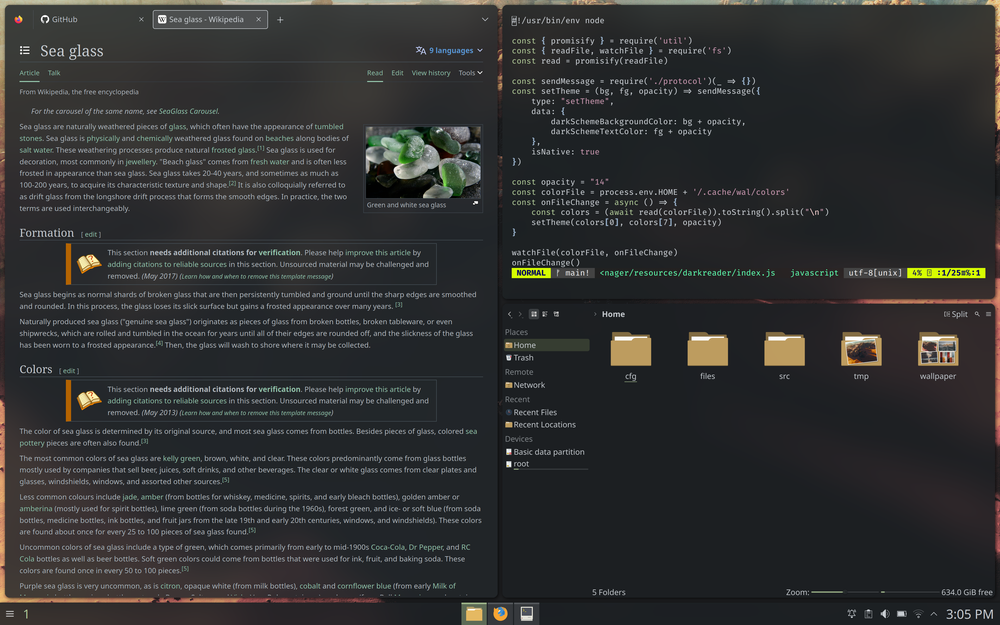
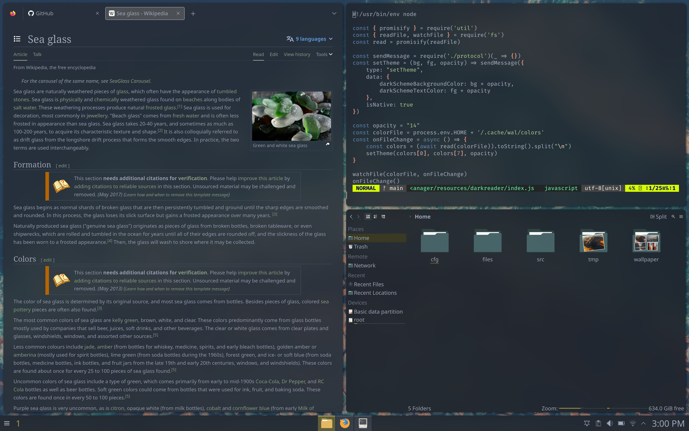

SeaGlass
========

What is this repository?
------------------------

This is a set of declarative Linux configuration files and scripts designed to consistently reproduce a modern desktop Linux environment with many unique features such as:

 - A color scheme engine that dynamically themes the entire operating system, including the vast majority of websites and qt/gtk applications
 - Global window background translucency effects (without sacrificing the opacity of foreground elements)
 - A global command pallete for quickly searching through file, edit, etc menus (like Unity)
 - Support for running i3 as a window manager alongside KDE
 - A modern zsh config with all of the shortcuts and autocomplete features from the fish shell

 This repository is designed to provide quick and automatic configuration of all these features on a fresh Arch Linux installation, although configuration for NixOS is available on an older branch.

 Currently, these configuration files need to be cleaned up to modularize the various features they provide, but in the meantime, here is a quick summary of how some of the features works:

 <h3>Color Scheme Engine</h3>
 The color scheme engine is implemented with a combination of [pywal templates]() and [a custom fork of the dark reader addon for firefox](). This fork attaches to a custom firefox native extension that forwards the current pywal color scheme to the addon process. A compiled version of the dark reader fork is available in [user/resources/darkreader.xpi](user/resources/darkreader.xpi) and the associated native extension is available in [user/resources/darkreader](user/resources/darkreader). Everything else is in [user/firefox.nix](user/firefox.nix).

<h3>Global Transparency</h3>
The OS-wide frosted glass effect is achieved with a combination of [lightly-qt]() and [a glsl compositor shader](user/resources/theme/picom-chromakey.glsl). The shader uses a chromakey algorithm to selectively apply transparency to the system background color and colors close to it.

<h3>Automatic Configuration</h3>
The reproducible and declarative aspects of this repository come from its use of [aconfmgr]() and [nix home-manager](). The `system` folder contains the contents of my `~/.config/aconfmgr` folder and the `user` folder contains my `~/.config/home-manager` folder.